# Working-with-Docker-Images
```
This project introduces Docker, a key containerization tool for building and managing applications. You’ll explore Docker images and learn to create efficient, scalable, reusable containers. Through hands-on activities, you’ll gain practical skills to streamline workflows, boost scalability, and ensure consistency across environments.
```
# Introduction
```
In today’s software development landscape, containerization has become a cornerstone for building, deploying, and managing applications efficiently. This project introduces you to the fundamentals of Docker, one of the most widely used containerization platforms. Through hands-on activities, you will explore how Docker simplifies the process of packaging applications and their dependencies into lightweight, portable containers.

The project focuses on understanding Docker images, the building blocks of containers—and guides you step by step in creating efficient, scalable, and reusable containers. By engaging with these activities, you will not only grasp the technical intricacies of Docker but also gain practical experience in leveraging containerization to streamline development workflows, enhance scalability, and improve consistency across different environments.
```
## Docker Images
```
Docker images form the foundation of containers, serving as the blueprint from which containers are created. A Docker image is a lightweight, portable, and self-contained package that includes everything necessary to run a software application reliably across different environments. This package typically consists of the application code, the runtime environment, essential libraries, system tools, and any dependencies required for execution.

Images are not built randomly; they are generated from a structured set of instructions written in a file called a Dockerfile. The Dockerfile defines the environment in which the application will run by specifying the base operating system, required software packages, configuration details, and commands to assemble the image. Each instruction in the Dockerfile creates a new layer, making Docker images modular, reusable, and efficient.

Because of their lightweight and portable nature, Docker images can be easily shared, versioned, and deployed across multiple platforms—ensuring consistency between development, testing, and production environments. This makes them a crucial element in modern software development and DevOps workflows.
```
## Pulling Images from Docker Hub
```
Docker Hub is a cloud-based registry where Docker images are stored and shared. It contains a huge collection of ready-to-use images for different applications, operating systems, and tools. Instead of creating an image from scratch, you can download (or pull) images directly from Docker Hub to your local machine using the docker pull command.

If you want to look for a specific image, Docker also provides a search option. For example, to find the official Ubuntu image, you can use the docker search ubuntu command. Once found, you can pull it to your system and start using it right away.
```
```
docker search ubuntu
```
```
This command helps you find and explore different images available on Docker Hub by showing a list of results that match your search term. Example below:
```
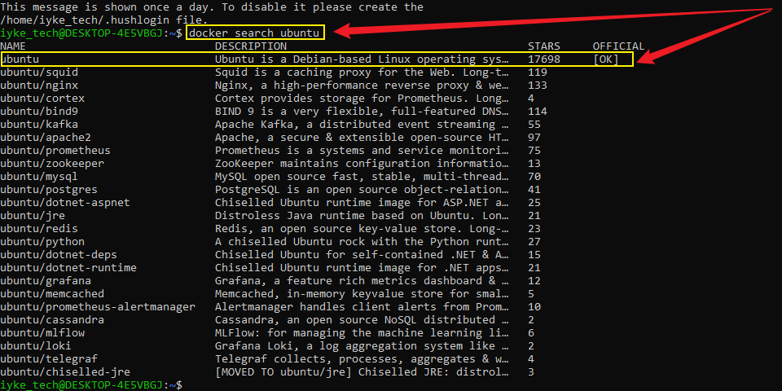

```
In the “OFFICIAL” column of the search results, the “OK” mark means that the image is officially built and supported by the organization that maintains the project. This helps you identify trusted and reliable images.

Once you find the image you need, you can download it to your local machine using the docker pull command. For example, to get the official Ubuntu image, you would run:
```
```
docker pull ubuntu
```
```
When you run this command, Docker downloads the official Ubuntu image from Docker Hub and saves it on your local system. Once stored, the image is ready to be used for creating and running containers whenever you need it.
```
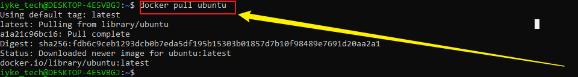
```
After downloading an image, you can start a container from it using the docker run command. If the image is not already on your machine, Docker will automatically download it first before running the container (just like it did with the hello-world example).

To see all the images that are currently saved and available on your local system, you can use this command:
```
```
docker images
```
```
When you run this command, Docker shows a list of all images saved on your local machine. This helps you confirm that your image was downloaded successfully and also gives you useful details such as its name, version (tag), image ID, and size.
```
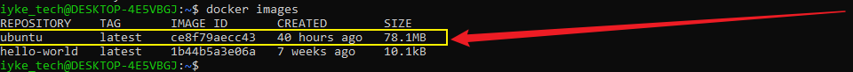
```
As we move forward in this project, you will begin using the downloaded images to create and work with containers, gaining hands-on experience in running applications inside them.
```
## Dockerfile
```
A Dockerfile is a plain text file that contains step-by-step instructions for building a Docker image. Think of it as a blueprint that tells Docker exactly how to set up the environment your application needs. By using a Dockerfile, you can make sure your application and all its dependencies are packaged in a consistent and reproducible way. This makes Dockerfiles an essential part of the containerization process.
```
## Creating a Dockerfile
```
In this Dockerfile, we will use the Nginx image. Nginx is open-source software that can serve websites, act as a reverse proxy, handle caching, load balancing, media streaming, and more. It was originally designed to be a fast and stable web server.

To create a Dockerfile, open a text editor you like, such as vim or nano. A Dockerfile usually starts by specifying a base image, then sets a working directory, copies your files, installs any dependencies, and configures the runtime environment.

Here’s a simple example of a Dockerfile for serving an HTML file. This will create a Docker image using Nginx. Save the code below in a file named Dockerfile. This example assumes you have a basic HTML file called index.html in the same folder as your Dockerfile.
```
```
# Use the official NGINX base image
FROM nginx:latest

# Set the working directory in the container
WORKDIR  /usr/share/nginx/html/

# Copy the local HTML file to the NGINX default public directory
COPY index.html /usr/share/nginx/html/

# Expose port 80 to allow external access
EXPOSE 80

# No need for CMD as NGINX image comes with a default CMD to start the server
```
## Explanation of the Dockerfile Instructions Using Real-World Project

`FROM nginx:latest`
 ```
This line tells Docker to use the official NGINX base image from Docker Hub. The image already comes pre-installed with the NGINX web server, so we don’t need to set it up manually. Using latest ensures that the most recent version of NGINX is pulled when the image is built.
```
`WORKDIR /usr/share/nginx/html/`
```
This sets the working directory inside the container to NGINX’s default public directory. Any files copied or commands executed after this instruction will be relative to this directory. By default, NGINX serves static content (like HTML files) from this location.
```
`COPY index.html /usr/share/nginx/html/`
```
This command copies the local index.html file (from the same folder where the Dockerfile is located) into the container’s public directory. Once inside the container, NGINX will automatically serve this file when a request is made to the server.
```
`EXPOSE 80`
```
This declares that the container will listen on port 80, which is the default HTTP port used by web servers. It acts as documentation within the Dockerfile and helps when running the container with -p to map ports, but on its own it does not publish the port externally.
```
`CMD (not explicitly defined here)`
```
There is no need to add a CMD instruction in this Dockerfile because the official NGINX image already includes a default command that starts the NGINX server in the foreground. This ensures that when the container runs, NGINX automatically launches and serves the static content placed in its public directory.
```
```
echo "Welcome to ICO-Tech" »› index.html
```
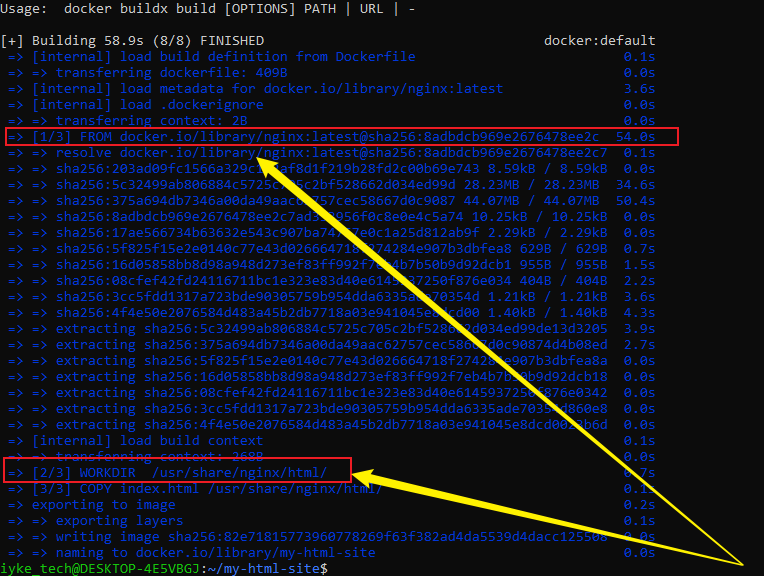
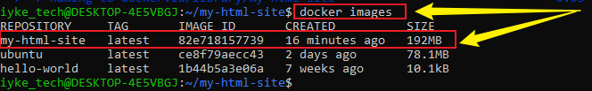
```
To start a container from the custom NGINX image that was built using the Dockerfile, you need to use the docker run command. This command creates a new container instance based on the image, assigns it runtime configurations such as port mappings, and then launches it so that NGINX can begin serving the HTML content you provided.
```
```
docker run -p 8080:80 dockerfile
```
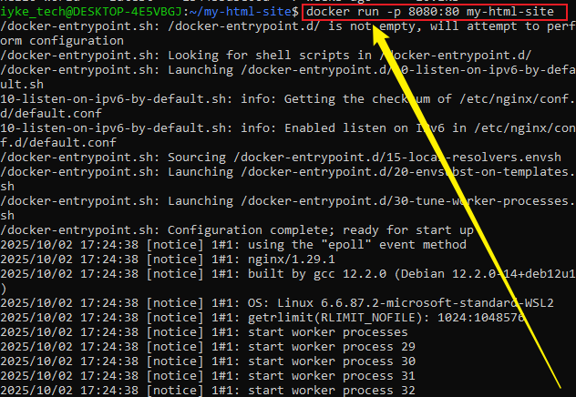
```
Executing the above docker run command will launch a new container from the custom NGINX image that you built earlier. This container is configured to listen on port 8080 of the host machine, which is mapped to port 80 inside the container where NGINX is running.

Since i am deploying this setup on an Amazon EC2 instance, I will also need to ensure that inbound traffic to port 8080 is permitted. To do this, i create (or update) a security group rule associated with your EC2 instance that allows inbound connections on port 8080 (typically from your own IP address or from all IPs, depending on your access requirements).

This step is necessary because, by default, EC2 security groups block all external traffic except what is explicitly allowed. Without updating the security group, you will not be able to access your NGINX-hosted page from your browser.
```
```
Applyingthe knowledge of permission. Now let's add new rules to the security group
```
- On our EC2 instance, click on the security tab.
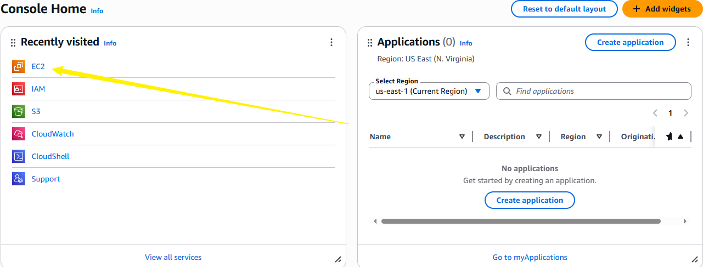

- Click on edit inbound rules to add new rules. This will allow incoming traffic to instance associated with the security group. Our aim is to allow incoming traffic on port 8080.
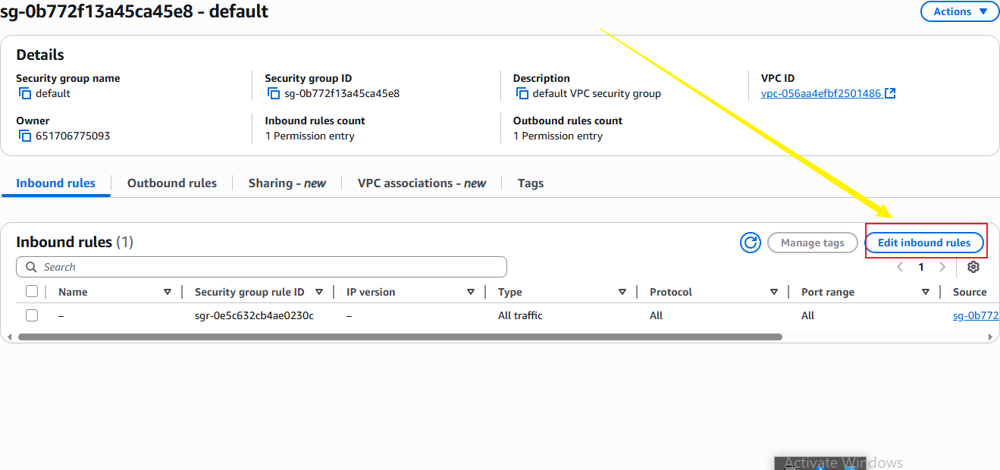

- Click on 'Add rule' to add a new rule.
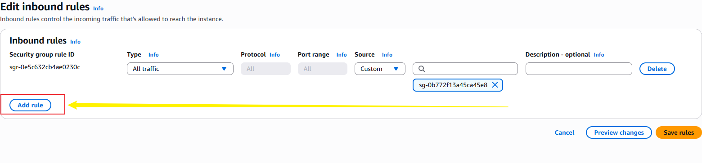
```
docker ps -a
```
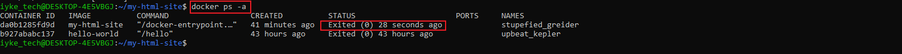
```
The image above show our container is not running yet. We can start it with the command below
```
```
docker start CONTAINER_ ID
```
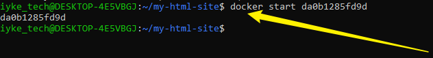
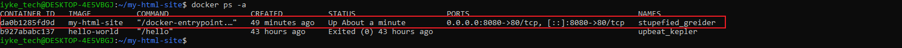
```
Now that we have started our container, we can access the content on our web browser with http:/ / publicip_adderss:8080
```
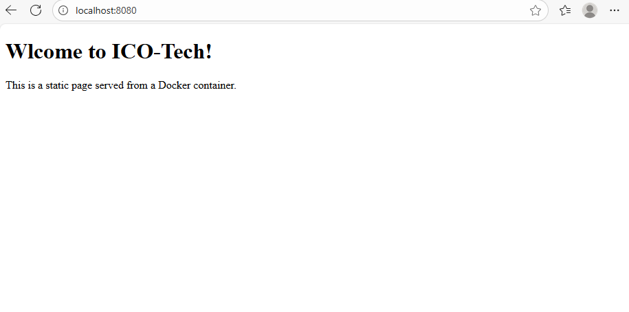
## Pushing Docker Images to Docker Hub
```
Think of Docker images like the code in a Git project. Just as we push changes from our local Git repository to a remote repository on GitHub so that others can see, collaborate, and reuse our code, Docker images can also be shared and reused across different machines or by other people.

Once you have created a Docker image on your local computer, you may want to use it on another machine, share it with colleagues, or collaborate with others. Docker Hub is the central platform for hosting and sharing Docker images, allowing your images to be easily accessed and reused worldwide.
```
- `Step 1: Create a Docker Hub Account:` If you don’t already have an account, go to https://hub.docker.com
 and sign up. Your account will allow you to host repositories and manage your images.
- `Step 2: Create a Repository on Docker Hub:` Once logged in, create a new repository in Docker Hub. The repository will serve as the storage location for your Docker images. Give it a meaningful name that reflects the purpose of the image.
- `Step 3: Tag Your Docker Image:` Before pushing your image, you need to tag it correctly. Tagging tells Docker Hub where to store your image and under which account. The typical format is:
```
docker tag ‹your-image-name> ‹your-dockerhub-username>/<your-repository-name>: ‹tag>
```
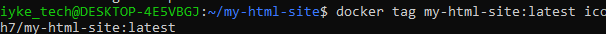
```
 Login to Docker hub
 ```
 ```
 docker login -u ‹your-docker-hub-username>
 ```
 ```
 Running the command above will prompt you for a password. Authenticate using your docker hub password
 ```
 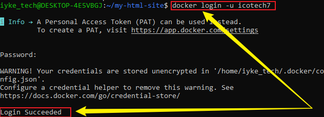
 ```
 Push you image to docker hub
 ```
 ```
 docker push ‹your-dockerhub-username>/<your-repository-name›: ‹tag>
 ```
 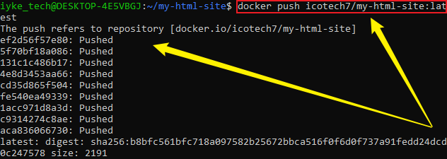
```
Verify the image is in your docker hub repository.
```
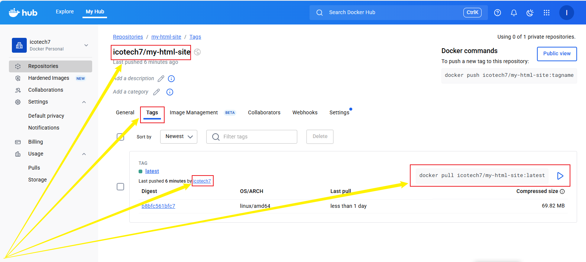
```
Once your image has been successfully pushed to your Docker Hub repository, it becomes publicly accessible (unless you set it to private). This means that anyone with Docker installed can pull and run the image directly on their own machine using the repository name and tag. By hosting your image on Docker Hub, you make it reusable, portable, and easy to share across different environments, allowing other developers, teams, or systems to quickly deploy and work with the exact same containerized application you created.
```
## Summary
```
In this project,I have successfully deployed a simple static web page inside a Docker container using NGINX. First, an Ubuntu EC2 instance is launched and connected via SSH. A project directory is created to store the index.html file, along with a Dockerfile. The Dockerfile uses the official NGINX image as a base, copies the static web page into NGINX’s default directory, and exposes port 80 to make the application accessible.

Once the Dockerfile is prepared, a custom Docker image is built by running the docker build command. This process packages the HTML file and the NGINX configuration into a reusable image. The image is then used to create and run a container, with port mapping set to forward traffic from port 8080 on the host to port 80 inside the container where NGINX serves the content.

Finally, the deployment is verified by obtaining the public IP address of the EC2 instance and accessing it in a web browser via http://<public-ip>:8080. If successful, the static page loads, confirming the containerized application is running. This process demonstrates how to dockerize a static website, making it portable, reusable, and easy to share across different environments.
```